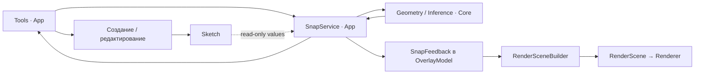

# Snap: архитектура, API и план реализации

**Статус:** руководство для постановки задачи и review реализации; описанные новые типы и методы являются предложением, а не существующим API.

**Область:** привязки и временный вывод геометрических отношений при работе с 2D-эскизом OurPaint CAD.

**Решение:** интерактивной системой управляет App; геометрические запросы и генерация геометрических кандидатов находятся в Core. Sketch остаётся источником геометрии. Инструменты используют общий сервис. Подсказки проходят через OverlayModel и RenderSceneBuilder.

**Зависимость от другой задачи:** транзакции и undo/redo разрабатываются отдельно владельцем проекта. Разработчик Snap не реализует их и не создаёт обходную систему отката. До готовности этого механизма постоянные автоматические ограничения отключены. Привязки позиции и временные направляющие можно реализовывать сейчас.

## 1. Задание разработчику и границы первой поставки

Нужно реализовать общий механизм, который по текущему геометрическому вводу инструмента:

1. Получает актуальную геометрию активного эскиза.
2. Вычисляет допустимые кандидаты привязки.
3. Выбирает кандидат с учётом экранного расстояния, контекста и устойчивости взаимодействия.
4. Возвращает исходное и эффективное положение вместе с источниками и смыслом привязки.
5. Позволяет подавлять привязку, блокировать кандидата и переключать альтернативы.
6. Публикует данные для общей отрисовки подсказок.

В первую поставку входят:

- Point entities, концы линий и дуг, центры окружностей и дуг;
- аффинная середина отрезка;
- H/V относительно опорной точки и локальных осей эскиза;
- интеграция в PointTool и LineTool, включая preview до первого клика;
- отдельное snap-состояние OverlayModel и его отрисовка;
- единый путь расчёта при движении, клике, изменении модификаторов и камеры;
- screen-space acquisition, enter/leave hysteresis и детерминированный выбор;
- ограниченный, явно описанный scope источников;
- focused coverage и описание ограничений реализации.

Следующими самостоятельными шагами идут half-sweep midpoint дуги, nearest point на поддерживаемых кривых, аналитические пересечения, grid snap и работающие режимы CircleTool. Drag интегрируется отдельно с сохранением исходного baseline. Не следует включать всё перечисленное в один обязательный первый PR.

Не входят в первую поставку:

- постоянные автоограничения и обещание их фиксации в интерфейсе;
- транзакции, undo/redo, trial solve и обходная snapshot-система восстановления;
- изменение интерфейса solver backend ради Snap;
- реализация незавершённых ArcTool/CubicBezierTool или новых CAD-инструментов;
- полный сплайновый inference, сложное распознавание и автоматическое полное ограничение эскиза;
- многопоточность, постоянный пространственный индекс и новая сторонняя библиотека без доказанной необходимости;
- внешняя/фоновая геометрия до появления корректного поставщика её координат и идентичности.

Первый этап должен честно называться **привязкой позиции и временным inference**, а не завершённым механизмом автоматического наложения ограничений.

## 2. Как читать документ

Для начала разработки достаточно прочитать разделы 1, 3–8, 10 и 15–17. Для интеграции в инструменты нужны также разделы 9 и 11. Ограничения текущего кода и ожидание транзакций собраны в разделах 12–13. Соответствие спецификации находится в разделе 18.

Основные исходные документы:

- [Спецификация Sketcher, редакция 0.2](sketcher-specification.md).
- [Текущая архитектура и API Sketch](sketch-architecture.md).
- [Правила проекта](../../AGENTS.md) и [стандарт кодирования](../../CODING_STANDARD.md).

Спецификация Sketcher описывает долгосрочную цель. Её требования действуют для заявленных возможностей, но не означают, что весь перечень нужно реализовать в этой задаче. Разделы 26–27 спецификации содержат архитектурные рекомендации, а не обязательный набор библиотек и классов.

## 3. Почему Snap разделён между App и Core

### 3.1 Две разные задачи

**Геометрический расчёт** отвечает на вопросы: где находится конец, центр, середина, пересечение или ближайшая точка; какое направление удовлетворяет H/V; допустимы ли домен и регулярность источника.

**Интерактивная политика** отвечает на вопросы: какой вариант сейчас полезнее пользователю; достаточно ли он близок на экране; удерживать ли предыдущий кандидат; как учитывать hover, selection, числовую блокировку, suppression и cycling.

Размещение всей системы в App приводит к дублированию геометрии между picking, inference и будущими editing/topology. Размещение всей системы в Core приводит туда пиксели, клавиши, hover и состояние жеста.

Рекомендуемая граница прямо соответствует [§26.2 спецификации](sketcher-specification.md#262-рекомендуемые-логические-модули): геометрические вычисления inference переносимы, обработка курсора и ранжирование в экранном пространстве принадлежат App. Таблица [§27, SK-BND-001](sketcher-specification.md#27-границы-ответственности-между-модулями) дополнительно отделяет presentation от вычислений.

### 3.2 Распределение ответственности

| Компонент | Слой | Ответственность | Не делает |
| --- | --- | --- | --- |
| CurveQueries | Core | Bounds, characteristic sites, nearest point, intersections, domains и качество результата | Не выбирает UI policy и не изменяет Sketch |
| InferenceQuery | Core | Геометрические кандидаты по probe, anchors и разрешённым семействам | Не знает Camera, ToolId, mouse events, цветов или клавиш |
| SnapService | App | Screen ranking, acquisition, hysteresis, lock, cycle, suppression и текущая сессия | Не записывает entities/constraints и не вызывает solver |
| Tool | App | Смысл шага, anchors, working geometry, числовые ограничения и принятие ввода | Не дублирует общие алгоритмы поиска/ранжирования |
| Команда создания/редактирования | App и существующий Core API | Применение принятого размещения; в будущем безопасный commit отношений | Не угадывает источники заново по координатам |
| SnapFeedback и scene builder | App | Подсветка, символы, подписи, стили и clipping | Не доказывает допустимость отношения по внешнему виду |
| Renderer | Render | Обычные visual primitives и слои | Не знает GeometryRef, SnapKind, Sketch или solver |



Эта схема описывает обязанности, а не требует отдельного объекта, интерфейса, потока или библиотеки для каждого блока. Начать следует с небольших функций над существующим variant `SketchGeometry`.

### 3.3 Критическая оценка исходного наброска

Схема `request → snap → response` полезна: расчёт отделён от отрисовки, результат возвращается клиенту. Однако первоначальный payload недостаточен.

| Набросок | Проблема | Рекомендуемый контракт |
| --- | --- | --- |
| Курсор `(x, y)` | Не заданы система координат и единицы | Явные screen logical и sketch-local значения |
| `tool / mode` | Engine зависит от перечня инструментов и их автоматов | Роль ввода, рабочая геометрия и допустимые семейства |
| `clicks: N` | Число кликов не выражает геометрический смысл | Явные anchors и ограничения размещения |
| Все объекты сцены на каждый move | Не заданы владение, актуальность, scope и стоимость | Сервис подключён к источнику; запрос содержит небольшой контекст |
| Поиск ближайшей точки | Не описывает H/V, направления, hover priority, cycling | Типизированные кандидаты и отдельное ранжирование |
| Только итоговая точка | Потеря source, meaning, quality и alternatives | Placement плюс кандидат, происхождение и status |
| Только `vector<Line>` | Нет маркеров, подписей, подсветки и состояния persistence | Семантические guides и SnapFeedback |
| Цикл только move/click | Пропускает key/view/model changes | Общий путь обновления ввода |

Сам `vector` не является ошибкой: линейный обход допустим для небольшого MVP. Ошибка — закрепить обязательное пересоздание всей сцены как универсальный алгоритм.

Предлагаемый более содержательный API тоже имеет цену: нужно определить несколько типов и lifecycle. Поэтому первое исполнение ограничено размещением точки; direction/radius и новые семейства добавляются вместе с работающими сценариями, а не заранее через универсальный framework.

## 4. Владение, зависимости и время жизни

### 4.1 Владелец сервиса

`SketchEditor` владеет одним SnapService для своей редакторской сессии и передаёт его нужным инструментам по ссылке. Это продолжает текущий паттерн владения picker и ConstraintActions в [SketchEditor](../../src/app/editor/SketchEditor.h).

Сервис заимствует `const core::sketch::Sketch&`. Sketch и Document должны жить дольше сервиса. При смене документа/эскиза создаётся новый сервис либо выполняется явно определённое переподключение с полным сбросом сессии. Не хранить ссылку на уничтоженный документ и не использовать глобальный singleton.

ID сущностей локальны для Sketch. Одинаковое числовое значение EntityId из двух эскизов не обозначает один источник. Сессия и результаты должны иметь контекст активного эскиза.

### 4.2 Что получает Core

Core inference не хранит постоянную ссылку на Sketch. Ему передаются owning query values или view на принадлежащие вызывающему коду значения только на время синхронного расчёта.

Первая реализация может получать `Sketch::entities()` на каждом update. Это detached значения, не второй изменяемый документ. Не требуется также получать полный `SketchSnapshot` с ограничениями на каждом движении.

`GeometryView` в примерах ниже — новый input view поверх этих значений, а не обещание borrowed views со стороны нынешнего Sketch API. Возвращаемые кандидаты и результаты владеют своими данными; в них нельзя сохранять span, iterator или указатель внутрь временного input.

### 4.3 Что получает App от камеры

Camera2D остаётся зависимостью App/view adapter. Для расчёта Snap формируется неизменяемый ProjectionSnapshot: преобразование между локальной плоскостью и logical screen, необходимые данные масштаба и версия/поколение вида.

Внутри App прямая заимствованная ссылка `const Camera2D&` технически допустима. Однако snapshot делает конкретный запрос воспроизводимым и упрощает headless-проверки ранжирования. Core не включает `Camera2D.h`, GLM camera matrices, Qt или render headers.

Для MVP view adapter может быть парой небольших функций; отдельный класс или виртуальный интерфейс не обязателен.

### 4.4 Зависимости

- Переносимая часть: C++20, стандартная библиотека, нейтральные типы `Vec2`, `SketchGeometry`, EntityId/GeometryRef из существующего [SketchTypes.h](../../src/core/sketch/SketchTypes.h).
- App: Sketch public API, состояние инструмента, selection/hover metadata и snapshot вида.
- Presentation: OverlayModel, ViewportStyle, RenderSceneBuilder и обычные render primitives.
- Никаких обращений Snap к OurPaintDCM/libslvs, private handles или `ISketchBackend`.
- Никакой новой сторонней библиотеки для enum mask, small vector, basic intersection или signal/event bus.
- Не редактировать UI/DCM submodules ради этой архитектуры без отдельной необходимости.

## 5. Координаты, допуски и числовой смысл

### 5.1 Контракт координат

| Значение | Система | Единицы |
| --- | --- | --- |
| Cursor input | Logical screen | Device-independent pixels |
| Probe, anchors, candidate position | Локальная плоскость Sketch | Единицы эскиза, выбранные владельцем |
| Acquisition radius и экранная толщина | Logical screen | Logical pixels |
| Углы | Локальная плоскость | Радианы |
| Render screen layer | Существующий render contract | Framebuffer pixels; перевод выполняет App |

Использовать отдельный ScreenLogicalPoint вместо повторного применения Vec2 без объяснения единиц. В текущем приложении world совпадает с плоскостью эскиза; новое API не должно превращать это совпадение в постоянное требование.

У сегодняшней Camera2D изотропный масштаб. Для broad phase:

```text
radiusLocal = radiusLogicalPx / camera.zoom()
```

Финальная проверка acquisition выполняется в logical screen относительно проекции `placement.probeSketch`. Для обычного placement probe соответствует курсору; для DragAnchor это предсказанное положение перемещаемого anchor и оно может отличаться от raw cursor из-за grab offset. DevicePixelRatio не умножает snap radius из input API. Для renderer преобразование координат и размеров производится один раз через App adapter; не смешивать logical и framebuffer pixels.

Broad phase должен покрывать leave radius текущего кандидата либо отдельно пересчитывать его по source/key. Иначе candidate исчезнет из геометрического результата сразу после пересечения enter radius и hysteresis не сработает. Locked/preferred sources вне обычной локальной области также проверяются явно.

При будущем повороте/наклонном размещении эскиза нужен корректный local-to-screen metric. Нельзя молча продолжать использовать один scalar zoom для анизотропной или перспективной проекции. Реализовывать такую проекцию сейчас не требуется.

### 5.2 Раздельные допуски

Пиксельная близость — основание предложить candidate, но не доказательство геометрического совпадения. Сохранённое положение вычисляется по источнику, а не округляется к координатам мыши. Постоянная связь в будущем задаётся точной публичной семантикой с численной проверкой.

Отдельно задаются positional/angular query tolerances, parameter/domain policy, acquisition enter/leave radii и display tolerances. Не вводить один общий `epsilon` для Snap, solver и topology. Числа выбираются и документируются на fixtures; в спецификации нет универсальной экспериментально установленной константы.

H/V относится к локальным осям Sketch. Вид или поворот камеры не переопределяет horizontal/vertical.

### 5.3 Domains и midpoint

- По умолчанию endpoint/nearest/intersection относится к конечному домену сущности.
- Продолжение линии или полная окружность вместо дуги — отдельное явно показанное семейство/support policy.
- Середина отрезка: аффинная середина.
- Середина дуги: выбранная половина её ориентированного углового размаха.
- Half-parameter, half-sweep и half-length на общих кривых не являются синонимами.
- Произвольный вычислительный seam окружности не является authored endpoint.
- Неподдерживаемый domain не возвращается как пустой успешный результат.

## 6. Кандидаты, источники и их идентичность

### 6.1 Что такое candidate

Candidate содержит как минимум:

- семейство;
- вычисленное размещение;
- исходные sites/entities;
- геометрический смысл и, при необходимости, предназначенное отношение;
- guides для объяснения;
- качество, domain и неоднозначность;
- ключ для устойчивого отслеживания.

SnapResult дополнительно содержит screen distance, порядок альтернатив и текущий выбранный вариант. Расстояние в пикселях не помещается в геометрический результат Core.

### 6.2 SourceSite

Нынешний GeometryRef имеет только Whole/Start/End/Center. Whole кривой не является точкой. Midpoint, intersection и nearest point нельзя кодировать как Coincident к Line Whole или поддельному EntityId.

Рекомендуемые формы transient site:

| Site | Данные |
| --- | --- |
| ExistingPointSite | GeometryRef точечного элемента |
| MidpointSite | Source entity и именованный вид midpoint |
| CurveParameterSite | Source curve, параметр с объявленным смыслом и finite/support domain |
| IntersectionSite | Две исходные кривые, параметры события, domain и выбранная ветвь |
| DatumSite | Идентичность явно поддерживаемого datum либо local origin внутри данной сессии |
| Alignment source | Source site или Anchor, относительно которого предложено направление |

Это transient descriptors. Они не добавляют Point entities при hover и не гарантируют постоянной ассоциативности. Для внешних источников впоследствии нужен квалифицированный reference provider, а не только локальный EntityId.

Координатно совпавшие endpoints сохраняют разные identities и остаются доступными для cycling. Не объединять их в одну source по сравнению `(x, y)`.

### 6.3 CandidateKey

Key определяется семейством, source identities, anchor identity и смыслом/ветвью. Не использовать индекс в результирующем векторе или точные текущие координаты как идентичность.

Для пересечений branch tracking сложнее, чем добавление номера найденного корня: порядок может измениться. При неопределённом соответствии старой и новой ветви сбросить lock и сообщить неоднозначность. Для MVP с endpoints/centers/midpoint достаточно ключей на typed source и anchor.

Принятые inputs временно хранятся в инструменте. Они не являются устойчивыми публичными Sketch references после произвольного структурного редактирования.

## 7. Предлагаемый API Core

Ниже приведён архитектурный эскиз, а не готовый header. Он показывает обязательные данные и границы. Вспомогательные типы описаны текстом; реализация должна определить их в соответствующих файлах и не оставлять undefined types из примера.

```cpp
namespace core::inference {

enum class SnapKind {
    Point,
    Endpoint,
    Center,
    SegmentMidpoint,
    ArcHalfSweep,
    NearestOnCurve,
    Intersection,
    Horizontal,
    Vertical,
    Datum,
    Grid
};

struct Anchor {
    AnchorId id;
    core::sketch::Vec2 position;
    std::optional<SourceSite> source;
};

struct GeometryView {
    std::span<const core::sketch::SketchEntity> entities;
};

struct CandidateQuery {
    core::sketch::Vec2 probe;
    std::vector<Anchor> anchors;
    std::optional<core::sketch::Line2> workingLine;
    std::vector<SnapKind> allowedKinds;
    std::vector<core::sketch::EntityId> excludedEntities;
    std::vector<CandidateKey> retainedCandidates;
    LocalSearchRegion search;
    PlacementRestriction restriction;
    QueryPolicy policy;
};

struct Candidate {
    CandidateKey key;
    SnapKind kind;
    core::sketch::Vec2 position;
    std::vector<SourceSite> sources;
    std::vector<GeometricIntent> intents;
    std::vector<Guide> guides;
    QueryEvidence evidence;
};

struct CandidateBatch {
    std::vector<Candidate> candidates;
    QueryReport report;
};

CandidateBatch findCandidates(
    const GeometryView& geometry,
    const CandidateQuery& query);

}  // namespace core::inference
```

### 7.1 Смысл вспомогательных типов

- AnchorId — идентичность шага/опорной точки внутри активной операции; она отличается от EntityId ещё не созданной геометрии.
- LocalSearchRegion — conservative область/радиус локального поиска и отдельно разрешённые preferred/anchor sources для удалённых guides.
- retainedCandidates — ключи текущего/locked кандидата для обязательной повторной проверки вне обычной области приобретения; они не обходят domain/restriction validation.
- PlacementRestriction — геометрические ограничения текущего размещения: например, свободная точка или линия определённого направления. Core не знает, какой клавишей они включены.
- QueryPolicy — поддерживаемый domain, раздельные численные допуски, ограничения числа проверок/итераций и требуемое качество.
- GeometricIntent — объяснение вроде «эта точка лежит на данном site» или «линия от anchor горизонтальна». Оно не равно готовому ConstraintDefinition и не запускает solver.
- Guide — local segment/ray/line или marker с reason и sources; цвета, локализация и clipping отсутствуют.
- QueryEvidence/QueryReport — execution status, searched scope, completed/incomplete coverage, supported/unsupported forms, accuracy estimate/bound при наличии и ambiguity.

Пустой список кандидатов с Complete означает, что в заявленной области не найдено подходящих кандидатов. Пустой список с Incomplete/Unsupported/Error не имеет такого смысла. Incomplete может также сопровождаться полезными найденными кандидатами.

Общие математические операции находятся в `core::geometry::CurveQueries`, а не заново реализуются в каждом inference rule. Например:

```cpp
namespace core::geometry {

SiteQueryResult characteristicSites(
    const core::sketch::SketchEntity& entity,
    const SiteQuery& query);

ClosestPointResult closestPoint(
    const core::sketch::SketchGeometry& curve,
    core::sketch::Vec2 probe,
    const CurveQueryPolicy& policy);

IntersectionResult intersections(
    const core::sketch::SketchGeometry& first,
    const core::sketch::SketchGeometry& second,
    const IntersectionPolicy& policy);

}  // namespace core::geometry
```

Типы результата расширяются вместе с поставляемыми операциями. Для intersection необходимо различать isolated points, overlap intervals и unresolved cases; нельзя сводить любые совпадающие кривые к случайной точке.

При добавлении direction/radius ввода Candidate placement можно расширить явным variant. Не требуется вводить универсальный variant до появления работающего потребителя. Семейства, отсутствующие в active capability set, возвращают понятную причину Unsupported.

## 8. Предлагаемый API App

### 8.1 Запрос и результат

```cpp
namespace app::snap {

struct ScreenLogicalPoint {
    double x;
    double y;
};

enum class InputRole {
    PlacePoint,
    LineEndpoint,
    CircleCenter,
    CirclePoint,
    ArcPoint,
    DragAnchor
};

struct PlacementContext {
    InputRole role;
    core::sketch::Vec2 probeSketch;
    std::vector<core::inference::Anchor> anchors;
    std::optional<core::sketch::SketchGeometry> provisionalGeometry;
    std::vector<core::inference::SnapKind> allowedKinds;
    NumericLocks numericLocks;
    DirectionPolicy direction;
};

struct SnapRequest {
    ScreenLogicalPoint cursor;
    ProjectionSnapshot projection;
    PlacementContext placement;
    SourcePolicy sources;
    AcquisitionPolicy acquisition;
    std::vector<core::inference::SourceSite> preferred;
    std::vector<core::sketch::EntityId> excludedEntities;
};

struct RankedCandidate {
    core::inference::Candidate candidate;
    double distanceLogicalPx;
};

enum class FeedbackMeaning {
    None,
    SnapOnly,
    TemporaryInference,
    ProposedPersistentRelation,
    Rejected
};

enum class PlacementStatus {
    Usable,
    InvalidInput,
    UnsupportedRestriction,
    Unavailable
};

struct SnapResult {
    InputStamp stamp;
    core::sketch::Vec2 rawPosition;
    std::optional<core::sketch::Vec2> resolvedPosition;
    PlacementStatus placementStatus;
    std::vector<RankedCandidate> candidates;
    std::optional<core::inference::CandidateKey> active;
    FeedbackMeaning meaning;
    QueryReport report;
    std::vector<SnapIssue> issues;
};

class SnapService {
public:
    explicit SnapService(const core::sketch::Sketch& sketch);

    void begin(const SessionPolicy& policy);
    SnapResult update(const SnapRequest& request);

    void cycle(int direction);
    void setLocked(bool locked);
    void setSuppressed(bool suppressed);

    std::optional<AcceptedInput> captureChoice(QueryId expectedQuery) const;
    void reset();
};

}  // namespace app::snap
```

`captureChoice` возвращает и обычный допустимый непривязанный input при отсутствии candidate. `nullopt` означает недоступный/устаревший запрос либо недопустимое размещение. Принятие разрешено только при PlacementStatus::Usable и наличии resolvedPosition. Nonfinite input, неподдерживаемая обязательная restriction или невозможность определить допустимый placement не превращаются в fallback к произвольной точке.

PlacementStatus независим от QueryReport: ограниченный поиск может дать пригодное snap-only размещение, а полностью завершённый поиск не делает некорректный numeric input допустимым. QueryId проверяет соответствие последнему update внутри сервиса, но не заменяет model revision: в MVP обновление на клике и непосредственное использование результата выполняются синхронно и последовательно.

### 8.2 Дополнительные контракты

| Тип | Контракт |
| --- | --- |
| ProjectionSnapshot | Immutable local-to-logical и logical-to-local mapping текущего запроса; поколение вида |
| NumericLocks | Значения и смысл заблокированных координат/длины/угла; только реально поддерживаемые формы |
| SourcePolicy | Active sketch; construction inclusion; явно поддерживаемые видимость и scope, без вымышленных источников |
| AcquisitionPolicy | Enter/leave radii в logical pixels и policy переключения семейств |
| SessionPolicy | User settings и разрешённые режимы; persistent inference выключен до отдельного этапа |
| InputStamp | Sketch session, QueryId, view generation; model revision только после появления надёжного API |
| AcceptedInput | Position, выбранный source/intent, stamp и anchors/provisional role для последующего использования |
| SnapIssue | Структурированный code, affected source и квалифицированная причина; message key для presentation |

`toolId`, `clicks`, сырые KeyCode/Qt events не входят в query Core. Перечисление InputRole описывает геометрический ввод в App, а не дублирует список toolbar tools.

Для первой реализации отсутствующая model revision обозначается явно, например optional, а не фиктивным нулём, который выдаётся за гарантию актуальности.

### 8.3 Жизненный цикл и управление

| Вызов | Поведение |
| --- | --- |
| begin | Начинает ввод, очищает active/lock/cycle state; persistent настройки пользователя не теряются |
| update | Читает актуальную геометрию, пересчитывает eligible candidates и owning result; Sketch не изменяется |
| cycle | Меняет намерение выбора между допустимыми альтернативами; затем общий refresh публикует новый результат |
| setLocked(true) | Удерживает текущий допустимый candidate/site или явно выбранное направление |
| setSuppressed(true) | Временно отключает inference и его hints; не отключает numeric/manual restrictions инструмента |
| captureChoice | Копирует допустимый input из заданного свежего запроса; не добавляет entity или constraint |
| reset | Очищает transient session state; владелец/presentation отдельно очищает feedback; не отменяет редактирование модели |

Suppression временно имеет приоритет над lock. После его снятия источники проверяются заново; lock восстанавливается только при однозначной допустимости. Удалённый, недопустимый или неоднозначный источник освобождает lock с feedback. Если пользователь снял ограничения ввода или сменил смысл шага, stale candidate не сохраняется.

Конкретные клавиши определяются App/UI configuration. Существующее Shift-направление LineTool должно сохранить смысл; нельзя одновременно назначить Shift на suppression без отдельного решения интерфейса.

Непривязанный fallback — допустимое исходное размещение с учётом обязательных numeric/manual restrictions, а не всегда сырая точка курсора. При недопустимом числовом вводе не следует молча делать свободное размещение. SnapService не хранит OverlayModel: editor/tool/presentation вызывает clearSnap после reset или публикует пустое feedback.

## 9. Путь обработки и использование инструментами

### 9.1 Порядок расчёта

1. App получает исходные координаты и состояние controls.
2. Tool формирует PlacementContext для своего текущего шага.
3. View adapter получает snapshot и probe в локальных координатах.
4. SnapService считывает source geometry и проверяет её валидность/scope.
5. Core вычисляет разрешённые geometric candidates с учётом restrictions.
6. App измеряет экранные расстояния, применяет acquisition/ranking/hysteresis.
7. Result используется для tool preview и общего SnapFeedback.
8. При принятии повторяется update по текущему событию; инструмент сохраняет owning AcceptedInput.
9. Создание геометрии выполняется существующим путём инструмента с проверкой результата. Постоянные auto-relations пока не применяются.

Не перезаписывать координаты input events глобально. Marquee selection, выбор объектов для constraints, pan и обычный hover используют raw cursor. Point/Line/Circle placement и отдельные drag modes вызывают Snap осознанно.

### 9.2 Пример интеграции LineTool

Ниже псевдокод нового общего пути. Методы `makePlacementContext`, `makeSnapRequest`, `publishSnapFeedback` и проверка создания показаны как обязанности, а не как существующий API.

```cpp
SnapResult LineTool::resolveInput(ScreenLogicalPoint cursor) {
    auto context = makePlacementContext(cursor);
    auto request = makeSnapRequest(cursor, context);
    auto result = snap_.update(request);
    publishSnapFeedback(overlay_, result);
    if (result.placementStatus == PlacementStatus::Usable && result.resolvedPosition) {
        updateLinePreview(*result.resolvedPosition);
    } else {
        clearPlacementPreview();
    }
    return result;
}

void LineTool::acceptInput(ScreenLogicalPoint cursor) {
    const auto resolved = resolveInput(cursor);
    const auto input = snap_.captureChoice(resolved.stamp.query);
    if (!input) {
        return;
    }

    if (state_ == State::WaitingFirstPoint) {
        firstInput_ = *input;
        state_ = State::WaitingSecondPoint;
        snap_.reset();
        overlay_.clearSnap();
        return;
    }

    const auto created = document_.sketch().addLine(
        firstInput_.position, input->position);
    if (!created) {
        showCreationFailure(created.error());
        return;
    }

    finishCurrentElement();
}
```

Первый AcceptedInput хранит source, а не только координату. Пока транзакций нет, эти данные служат preview/объяснению и будущему расширению; приведённый путь не создаёт Coincident/H/V constraints.

На принимающем событии makePlacementContext получает modifiers и numeric/control state именно этого события. Сохранённое состояние последнего mouse move не заменяет текущие controls; в псевдокоде их передача опущена для краткости.

Нулевую линию или другое недопустимое создание инструмент не считает успешным. После отказа pending state и объяснение остаются понятными пользователю.

### 9.3 Какие изменения требуют refresh

- Mouse move и принимающий click/release соответствующего режима.
- Изменение modifiers, suppression, lock, cycle и numeric input.
- Pan, zoom, resize и изменение DevicePixelRatio.
- Изменение Sketch, source policy или selection/hover priorities.
- Переход к следующему шагу инструмента.

Сейчас ViewportController при wheel меняет камеру и запрашивает redraw, но не пересчитывает placement активного инструмента. Нужно добавить явный путь `refreshInput`/`refreshPreview` через SketchEditor или tool context с сохранённым raw cursor. Простого redraw недостаточно.

При wheel/resize не создавать синтетический принимающий click. При завершении/смене tool, смене Sketch, mouse leave и отмене provisional input очищать или явно приостанавливать feedback. Смысл pending geometry при mouse leave определяет инструмент; отсутствие курсора само по себе не коммитит элемент.

### 9.4 Drag

Drag интегрируется отдельным этапом:

1. CursorTool захватывает исходные references, позиции и точку захвата.
2. Объявляет конкретный moving anchor; несколько targets нельзя независимо snap-ить в разные места.
3. По общему displacement от press вычисляет предсказанную позицию anchor.
4. Snap рассматривает эту позицию и исключает moving entities.
5. Из resolved anchor выводится одно displacement.
6. Все DragRequests строятся от исходного baseline и отправляются вместе в dragPoints.
7. После solver показывается фактическая позиция и её отличие от requested target.

Snap raw cursor без учёта grab offset вызывает скачки. Накопление displacement от предыдущего solver result вызывает drift.

Screen distance при ранжировании в этом режиме измеряется от проекции predicted anchor к candidate, а не от raw mouse cursor. Raw cursor остаётся данными события и pointer feedback. Эта же точка определяет acquisition область.

В текущем CursorTool Circle Whole изменяет радиус, Circle Center перемещает центр. Универсальная подмена точки курсора этого не отражает. Для radius mode сначала нужен отдельный определённый контракт; не включать его автоматически в translation snap.

Обычный drag не добавляет постоянных ограничений. SnapService::reset не восстанавливает геометрию жеста: это будущая задача транзакций. До её готовности текущие ограничения cancel/undo честно фиксируются в PR, без обещания выполненного SK-DRG-001.

### 9.5 Числовые блокировки

Явно введённая длина, угол или координата ограничивает допустимое размещение. Candidate, который нарушает блокировку, исключается либо возвращается как отклонённое предложение. Нельзя сначала snap-ить точку, затем исправить её по числу и продолжать показывать прежний endpoint glyph.

Для сложной ограниченной области поиск должен вычислять допустимые размещения, а не просто выбирать ближайший объект и двигать его результат. Неподдерживаемую комбинацию числового ввода и snap обозначать явно; не реализовывать второй constraint solver внутри Snap.

## 10. Ранжирование, устойчивость и scope

### 10.1 Ранжирование

Предлагаемая последовательность:

1. Проверить роль, domain, numeric/manual restrictions и source scope.
2. Уважать явный candidate/direction lock, если он актуален и допустим.
3. Применить enter/leave hysteresis к текущему кандидату.
4. Предпочесть selected/hovered sources несвязанной nearby geometry.
5. Учесть приоритет семейства, установленный policy.
6. Сравнить экранное расстояние.
7. Разрешить равенство детерминированно по source/key.

Точная таблица family priorities — часть документированного App policy. Она должна позволять cycling и не менять выбор случайно из-за порядка обхода vector/map.

Enter radius меньше leave radius. Leave применяется только к текущему допустимому кандидату, а не даёт право приобретать новых дальних кандидатов. При исчезновении source или конфликте с explicit numeric lock кандидат освобождается независимо от hysteresis.

Текущий/locked candidate пересчитывается по retained source/key или в расширенной области. Candidate budget и truncation не должны молча исключить его до этой проверки; невозможность актуализировать source возвращается явно. Новые альтернативы по-прежнему проходят enter radius.

Явный direction lock может выходить за обычный acquisition radius по своему объявленному смыслу. Это отличается от удержания произвольного endpoint на большом расстоянии и должно быть видно в интерфейсе.

Не усреднять координаты двух несовместимых кандидатов. Набор нескольких правил допустим только как геометрически совместимое предложение. Например, endpoint и H/V могут одновременно выполняться; если нет, нужно выбрать/объяснить один вариант.

### 10.2 Scope и далёкие направляющие

Point/site acquisition ограничивается локальной областью. Intersection broad phase использует conservative bounds, а narrow phase — исходные поддерживаемые кривые.

Однако H/V guide может исходить от далёкого selected/hovered endpoint. Такие источники рассматриваются отдельно как ограниченный preferred/anchor set. Фильтр «только все entities, целиком лежащие в круге курсора» исключит полезные направляющие и пересечения длинных кривых.

Construction — разрешаемая категория snap sources, а не автоматическое исключение. Visibility и внешняя геометрия учитываются только если App действительно предоставляет соответствующие metadata/provider. Сам current Sketch не имеет UI visibility.

### 10.3 Picking и Snap

Cpu2dPicker выбирает существующий объект/reference для взаимодействия. Snap предлагает геометрическое размещение и объясняет его. Не использовать single-hit picker result как готовый candidate engine.

Общие geometry queries можно переиспользовать. Результаты, priorities и lifecycle остаются различными. Поддержка overlapping selection cycling сверх нужного Snap не должна незаметно разрастить эту задачу.

## 11. Подсказки и примеры поведения

### 11.1 Три смысла feedback

| Смысл | Поведение сейчас | Будущее расширение |
| --- | --- | --- |
| SnapOnly | Вычисленное размещение без связи | Поддерживается независимо от транзакций |
| TemporaryInference | Направляющая влияет на текущий ввод | Исчезает без изменения design definition |
| ProposedPersistentRelation | Отключено; не обещать запись relation | Включается после transactional commit integration |
| Rejected | Показывается причина недопустимого/неподдерживаемого предложения | Также используется для отклонённых автоотношений |

Даже если GeometricIntent описывает потенциальный Coincident, до готовности commit UI показывает SnapOnly. Совпавшие координаты новых и существующих endpoints не означают постоянной Coincident relation.

### 11.2 Организация отрисовки

В OverlayModel добавить независимый канал:

```cpp
std::optional<app::snap::SnapFeedback> snap_;
void clearSnap();
```

SnapFeedback владеет компактным состоянием active candidate, source sites, local guides, meaning и issues. Это App presentation value, а не GPU data и не обязательная копия всех alternatives.

Отдельная функция presentation преобразует SnapResult в SnapFeedback. Она может находиться в SnapService.cc или builder helper: отдельный SnapPresenter class не обязателен.

RenderSceneBuilder получает `buildSnapFeedback()`:

- источники и guides размещаются в local/world layer;
- glyphs и labels сохраняют logical экранный размер;
- бесконечные guides обрезаются viewport;
- conversion к framebuffer screen layer выполняется App;
- layer order делает подсказки читаемыми поверх preview;
- label/icon/text/pattern дополняет цвет.

Добавить отдельные стили в ViewportStyle. В RenderScene и OpenGL renderer не переносить SnapKind, GeometryRef, constraints или commands. При необходимости пунктир/формы маркеров реализуются как общая render capability либо простой glyph из screen lines.

Сейчас OverlayType::Snap уже объявлен, но builder рисует общие overlay arrays едиными preview styles. Сам enum не означает готовой отрисовки. Добавление snap lines в `overlay_.lines_` приведёт к их удалению через clearPreview и смешению смыслов.

`clearPreview`, `clearSelection` и `clearSnap` должны быть независимы; общий `clear` очищает всё. SelectionModel не используется как хранилище sources активной подсказки.

### 11.3 Примеры работы

**Конец новой линии рядом с существующим endpoint.** Tool передаёт LineEndpoint и первую точку. Snap предлагает точные текущие координаты существующего endpoint, показывает marker и source highlight. На клике создаётся линия. Пока постоянных auto-relations нет, после создания endpoints могут двигаться независимо; UI не показывает созданный Coincident.

**Горизонтальная линия.** Первая точка имеет координаты `(2, 3)`. При свободном probe `(8, 3.05)` geometric rule предлагает `(8, 3)`, а App проверяет экранную близость. Temporary guide показывает horizontal. При ручной блокировке направления размещение остаётся на этом направлении по явному policy. Поворот камеры не меняет смысл local horizontal.

**Середина отрезка.** Source line идёт от `(0, 0)` до `(10, 0)`. Candidate `(5, 0)` хранит MidpointSite этого source. При последующем изменении линии ранее созданная snap-only точка автоматически не перемещается. Для ассоциативности потребуется отдельное midpoint relation после транзакционного этапа.

**Два совпадающих endpoint.** Coordinates одинаковы, GeometryRef различны. Result содержит оба source candidates, выбор детерминирован; cycling позволяет указать нужный source. Механизм не объединяет identities.

**Числовая длина.** От первой точки введена длина 10. Nearby endpoint на расстоянии 11 не должен молча изменить её на 11. Candidate исключается/объясняется либо ищется допустимое размещение на locus длины 10. Glyph соответствует реально используемому placement.

**Drag точки.** Snap предлагает target существующего endpoint, но hard constraint не позволяет его достичь. CursorTool показывает solved position и различие requested/actual. Нельзя оставить Coincident-like feedback как выполненный факт. Permanent relation не создаётся.

**Zoom без движения мыши.** Probe и расстояния пересчитываются через новый snapshot. Active candidate может перестать удовлетворять leave radius. Подсказка не остаётся в состоянии старого zoom только потому, что не было mouse move.

**Intersection.** Если два конечных отрезка пересекаются, candidate хранит обе curves и параметры события. Их общая support intersection за пределами finite segments не является ordinary finite candidate. При overlap нет одной уникальной точки пересечения; нужен отдельный смысл или явная ambiguity.

**Suppression и lock.** Пользователь блокирует midpoint, затем временно подавляет inference. Подсказка исчезает, действует raw/обязательное restricted placement. При отпускании suppression source проверяется заново. Удаление source сбрасывает lock; старые coordinates не выдаются за актуальную привязку.

## 12. Состояние текущего репозитория и ограничения

Это ориентиры чтения кода, а не обещание runtime-проверки.

| Возможность/файл | Текущее положение | Следствие для Snap |
| --- | --- | --- |
| [Sketch.h](../../src/core/sketch/Sketch.h) | Есть entities, pointElements, pointPosition и detached query values | Можно реализовать синхронный read-only MVP |
| SketchTypes.h | Point/Line/Circle/Arc; GeometryRef Whole/Start/End/Center | Derived sites должны иметь свои descriptors |
| supportsConstraint | Аргументы и точная поддержка формы backend | Не проверяет conflict/redundancy всей системы |
| solve/drag | Failed attempt может оставить current iterate | Не считать все queried values принятым валидным решением |
| Geometry revisions/spatial query | Публичного revision/index API нет | Не делать постоянный кеш по entityCount или ID |
| [SketchEditor](../../src/app/editor/SketchEditor.cc) | Уже владеет общими picker/actions/tools | Естественный владелец SnapService |
| [LineTool](../../src/app/editor/tools/LineTool.cc) | Shift H/V дублируется в move/button/key | Перевести на общий resolve path, сохранив UX смысл |
| [PointTool](../../src/app/editor/tools/PointTool.cc) | Нет общего snap preview | Показывать candidate до первого клика |
| [CursorTool](../../src/app/editor/tools/CursorTool.cc) | Абсолютные targets от press; cancel не восстанавливает Sketch | Сохранить baseline; full gesture rollback ждёт транзакции |
| CursorTool Alt-click | Две ближайшие несвязанные точки выбираются без acquisition radius и сразу применяется Coincident | Не копировать эвристику; её миграция ждёт безопасный commit |
| [OverlayModel](../../src/app/viewport/OverlayModel.h) | Есть Snap enum, но общие arrays и clearPreview | Добавить независимое feedback |
| [RenderSceneBuilder](../../src/app/viewport/render/RenderSceneBuilder.cc) | Общие styles overlay primitives | Добавить отдельный snap path/styles |
| [ViewportController](../../src/app/viewport/ViewportController.cc) | Wheel меняет камеру без placement refresh | Явно пересчитывать active input на view changes |
| [AxisTexts](../../src/app/viewport/AxisTexts.cc) | Grid step выбирается по zoom | Snap/grid rendering должны получать согласованный policy |
| ArcTool/CubicBezierTool | Наличие tool класса не означает завершённую creation integration | Не включать их завершение в Snap PR |
| [SnapService.h](../../src/app/editor/snap/SnapService.h) | В рабочем дереве есть концептуальный незавершённый черновик | Требует определений типов, namespace/includes и реализации; не готовый сервис |

Queries могут вернуть unsolved значения, включая Arc с unequal radii после неудачного solve. Geometry layer проверяет необходимые representation invariants и возвращает issue/skip вместо вычисления произвольного midpoint или propagation NaN. Сохраняемые invalid definitions не удаляются автоматически.

До появления accepted-state boundary у Sketch Snap не может обещать, что любой прочитанный валидный iterate является последним принятым решением. Эта архитектурная задача не решается тайным вторым авторитетным хранилищем внутри Snap.

## 13. Транзакции и постоянные отношения: ожидание другой задачи

Транзакции/undo разрабатываются владельцем проекта отдельно. Разработчик Snap **не реализует** trial Sketch, snapshot rollback, новый undo manager или собственные правила восстановления.

До готовности общего механизма:

- SnapService остаётся read-only.
- SnapOnly и TemporaryInference доступны.
- GeometricIntent хранит смысл/происхождение, но не исполняется как constraint.
- ProposedPersistentRelation не предлагается как доступный режим фиксации.
- Обычный drag не добавляет отношения.
- Существующий manual constraint workflow не перерабатывается под видом Snap.
- Новые auto-constraint и snap-and-constrain paths ожидают отдельного интеграционного этапа.

Для будущей интеграции нужен общий commit path, который обеспечивает:

1. Привязку provisional operands к созданным public refs.
2. Проверку актуальности sources, точной поддержки и допустимости definitions.
3. Проверку obvious duplicates и независимости/конфликтов в пределах реально доступной диагностики.
4. Trial solve и проверку публичного геометрического смысла результата.
5. Отказ/пропуск auto-relations без удаления manual relations.
6. Атомарность обычных отказов, единый commit и одну undo action.
7. Отображение фактически принятого набора отношений.

Это требования к будущей совместной интеграции, а не обещание текущих supportsConstraint/ConstraintActions. Numerical convergence сама по себе не доказывает независимость всех relations. Недоступная диагностика обозначается как недоступная.

Постоянная midpoint/incidence/tangency relation включается только вместе с точной публичной семантикой и end-to-end support. Нельзя заменять её временно вычисленной точкой и заявлять ассоциативность.

## 14. Производительность, ревизии и сетка

### 14.1 Первый этап без постоянного кеша

При каждом синхронном update читать detached geometry, вычислять необходимый ограниченный набор candidates, не делать all-pairs intersections на каждый move.

Корректный O(N) scan для небольшого эскиза лучше недостоверного кеша. Следить за количеством выделений и избегать полного snapshot с constraints, если они не нужны. Возвращаемый список alternatives можно ограничивать, сохраняя честный report о scope/ограничении поиска.

### 14.2 Условия постоянного кеша

Ревизия должна изменяться на всех возможных geometry writes: updates, solve, drag, replaceState, backend changes и failure paths с частичным изменением. Source eligibility metadata/policy также инвалидирует соответствующие данные.

Счётчик только в одном tool недостаточен. Entity count/ID не обнаруживает движение. QueryId или cache generation не является model revision.

После появления надёжного revision/invalidation contract можно добавить conservative spatial index и reuse geometry values. Это derived cache с односторонним обновлением от модели. Любая ошибка чтения/инвалидации не превращается в успешное отсутствие candidates.

### 14.3 Потоки и бюджеты

Сначала синхронная реализация. Вызовы одного Sketch, включая const queries, должны внешне сериализоваться. Worker не читает live Sketch параллельно; при необходимости ему передаётся owning immutable snapshot.

При отложенной работе результаты привязываются к model/view/session/request stamps. Более старый запрос не заменяет новый. Bounded work, cancellation и Incomplete нужны, если семейство может превысить interactive budget.

Измерять generation, ranking, feedback и общий input latency отдельно. Пороги и benchmark corpus фиксируются по реальным измерениям, без заявления универсальной миллисекундной гарантии.

### 14.4 Grid snap

Grid rendering и Snap должны получать согласованные GridSettings/GridViewState. Snap не читает shader и не зависит от AxisTexts.

Рекомендуемый default — фиксированный шаг привязки в sketch units. Привязка к адаптивной отображаемой сетке возможна как явный режим. Если используются разные display/snap steps, UI должен их обозначать. Простой zoom не должен неожиданно менять скрытое правило координат.

Grid не создаёт persistent constraints. Origin/grid sites являются значениями внутри соответствующего контекста, не вымышленными Sketch EntityId.

## 15. Папки, файлы и подключение

### 15.1 Предлагаемая структура

```text
docs/ru/
    snap-architecture.md

src/core/geometry/
    QueryTypes.h
    CurveQueries.h
    CurveQueries.cc

src/core/inference/
    InferenceTypes.h
    InferenceQuery.h
    InferenceQuery.cc

src/app/editor/snap/
    SnapTypes.h
    SnapService.h
    SnapService.cc
    SnapProjection.h             # optional extraction
    SnapProjection.cc            # optional extraction

src/app/viewport/
    SnapFeedback.h

src/core/tests/
    CurveQueriesGTEST.cc
    InferenceQueryGTEST.cc

src/app/tests/
    SnapServiceGTEST.cc
```

Использовать `.cc`, как в соседних файлах. QueryTypes.h отделяется, когда общие result/policy types действительно используются несколькими запросами; в маленьком первом PR их можно держать в CurveQueries.h. SnapProjection отдельно выделяется при появлении достаточного объёма adapter logic.

Не создавать все файлы пустыми ради дерева. Начать с типов, работающей point/line geometry и сервиса; остальные добавляются вместе с реализацией. Существующий незакоммиченный SnapService.h — черновик, который нужно согласованно развить, не считать готовым модулем.

### 15.2 Что находится в каждом файле

| Файл | Содержание |
| --- | --- |
| QueryTypes.h | Neutral domains, numeric policies и quality-bearing query results |
| CurveQueries.h/.cc | Общие математические функции над SketchGeometry; без Sketch/Camera lifetime |
| InferenceTypes.h | SnapKind, SourceSite, Anchor, CandidateKey, Candidate, Guide, GeometricIntent |
| InferenceQuery.h/.cc | Генерация geometry candidates по value input; без screen ranking |
| SnapTypes.h | App request/result, logical points, projection/session/source/acquisition policy |
| SnapService.h/.cc | Заимствованный Sketch, transient session, update, rank/hysteresis и controls |
| SnapProjection.h/.cc | По необходимости conversion Camera2D/local/logical/framebuffer |
| SnapFeedback.h | Компактное owning presentation state; без GPU objects |
| GTEST files | Геометрические и интерактивные focused fixtures |

### 15.3 Существующие файлы, которые предстоит изменить

- `src/app/editor/SketchEditor.h/.cc`: ownership сервиса, передача tool dependencies, общий refresh/reset.
- `src/app/editor/tools/PointTool.h/.cc`, `LineTool.h/.cc`: resolve input и сохранение AcceptedInput.
- `CircleTool`, `CursorTool`: отдельные последующие integration slices.
- `src/app/viewport/OverlayModel.h`: snap feedback и независимая очистка.
- `src/app/viewport/render/RenderSceneBuilder.h/.cc`: buildSnapFeedback.
- `src/app/viewport/ViewportStyle.h/.cc`: snap styles.
- `src/app/viewport/ViewportController.h/.cc`: view changes вызывают refresh active input.
- Component CMakeLists.txt для добавленных sources и тестовых целей.

Sketch/backend interface не меняется ради basic MVP. Revision API — отдельный согласованный этап перед кешированием. RenderScene/renderer меняется только если нужна отсутствующая общая visual capability.

### 15.4 CMake и headless граница

Новая библиотека не обязательна только потому, что появились папки. Для первого небольшого этапа переносимые `.cc` можно подключить к существующему portable target `ourpaint_sketch`/`OurPaint::Sketch` через его CMakeLists.txt; новые App sources — к `ourpaint`. Это размещение в сборке не делает inference частью solver backend.

Если потребуется запускать geometry/inference независимо от всех solver adapters, выделить небольшой portable target без Qt/OpenGL/backend linkage отдельным решением. Не подключать geometry только к Qt-приложению: Core coverage должен собираться headless.

Новые Core tests регистрируются в `src/core/tests/CMakeLists.txt`, App tests — рядом с существующим `src/app/tests/CMakeLists.txt`. Написание тестов не разрешает их запуск: действуют правила AGENTS.md.

## 16. План PR и критерии завершения этапов

### Этап A — Типы и геометрическая основа

Результат: neutral SourceSite/Anchor/Candidate, point/end/center/segment midpoint/HV rules и QueryReport. Есть domain/invalid input checks и focused fixtures. Нет App headers в portable files, нет редактирования Sketch в query.

### Этап B — App-сессия и Line/Point

Результат: SnapService в SketchEditor, logical pixel acquisition, hysteresis, deterministic alternatives, lock/cycle/suppress, единый resolve input и отдельный feedback. Работают первый и второй click, modifier/view refresh, Escape и tool switch. Permanent auto-relations выключены.

### Этап C — Дополнительные семейства и инструменты

Последовательные PR: arc half-sweep/nearest point; finite analytic intersections; grid; работающие circle placement inputs. Для каждого семейства фиксируются support, quality, ambiguity, scope и ограничения.

Не заявлять tangency/parallel/equal-size только на основании появления enum. Требуется математически определённый placement и объяснение. Сплайны и сложные контекстные предложения — самостоятельные последующие задачи.

### Этап D — Drag и устойчивость

Результат: anchor/grab-offset semantics, общий displacement от baseline, exclusions, actual/requested feedback. Не создаются permanent relations. Full cancel restoration/undo ждёт общую transactional задачу; это явно указано в coverage/PR.

### Этап E — Измерения и кеш

Результат: representative benchmarks и описанный budget. Пространственный индекс вводится только после надёжной инвалидации/revision contract и измеренной необходимости. Не включать threads по умолчанию.

### Этап F — Интеграция после транзакций

Начинается после готовности общего API от владельца проекта. Snap передаёт accepted proposals в общий command/transaction path. Первые persistent формы — поддерживаемые Coincident/H/V; далее только end-to-end поддерживаемые relations. Миграция Alt snap-and-constrain тоже относится сюда.

Этап F не блокирует A–C. Его отсутствие не скрывается и не компенсируется самодельным rollback.

## 17. Coverage, review и ограничения выполнения

### 17.1 Геометрические fixtures

- Standalone point, endpoints, centers и midpoint с ожидаемыми координатами и refs.
- Несколько совпадающих координат с разными source identities.
- H/V от anchor, включая далёкий preferred source.
- Finite/support различие, arc sweep/seam и необходимые domain checks.
- Invalid/nonfinite/degenerate geometry; unequal arc radii после failed iterate.
- Для intersections: line-line, line-circle, circle-circle и arc-domain variants; transverse/tangent, endpoint, overlap, no-hit, unsupported и incomplete.
- Перенос/поворот геометрических fixtures и допустимое изменение масштаба с корректно перенесённой numerical policy.

### 17.2 App fixtures

- Одинаковый logical acquisition при разных zoom/DPI с соответствующим преобразованием.
- Enter/leave hysteresis без дрожания на границе; новый source не приобретается по leave radius.
- Детерминированный выбор и cycling независимо от порядка возвращённых geometry records.
- Lock, suppression, удалённый/неоднозначный source и смена шага.
- Numeric/manual restriction не нарушается candidate selection.
- Click пересчитывается по текущим coordinates/modifiers; capture старого QueryId отклоняется.
- Недопустимое/nonfinite размещение не принимается; query completeness и placement admissibility проверяются отдельно.
- Wheel/resize без mouse move обновляет input/feedback.
- Preview/selection/snap очищаются независимо.
- Drag не теряет grab offset и не накапливает projected displacement.
- Нет новых constraints при move, snap-only creation и ordinary drag.

Для первой поставки писать проверки только реально объявленных семейств. Необходимое будущее coverage перечисляется в PR как следующий этап, а не выдаётся за выполненное.

### 17.3 Вопросы для review PR

- Остались ли geometry и screen policy в своих слоях?
- Не появились ли Camera/Qt/render/backend handles в portable API?
- Не стал ли Snap вторым mutable authoritative Sketch?
- Сохраняются ли source identities, domain и meaning результата?
- Можно ли понять snap-only/temporary/disabled persistent по feedback?
- Есть ли fresh calculation на принятии и честные error/incomplete states?
- Учитываются ли explicit numeric locks, exclusions и source scope?
- Не обещается ли solved coincidence только по предложенному target?
- Не построен ли stale cache по count/ID?
- Не реализован ли обходной trial/undo mechanism вопреки разделению задач?
- Не включены ли незапрошенные инструменты, solver changes или submodule edits?
- Явно ли перечислены проверенные и непроверенные сценарии?

По текущим правилам проекта приложение, тесты, полная сборка и CI не запускаются без явного запроса пользователя. Можно читать код, писать coverage и выполнять узкие статические проверки. Если требуется компиляция без запроса полной сборки, ограничиться затронутой целью согласно AGENTS.md. Никогда не заявлять runtime/build/test success без соответствующего результата.

## 18. Связь со спецификацией

Ссылки ведут на главы русской спецификации. SK-* указаны отдельно, потому что отдельные requirement IDs оформлены абзацами/строками таблиц и не имеют самостоятельных anchors.

| Глава и пункты | Что относится к Snap |
| --- | --- |
| [§3, SK-SYS-002/003](sketcher-specification.md#3-определение-системы-построения-эскизов) | Headless domain; локальная плоскость и независимость H/V от камеры |
| [§4, SK-PRN-001/003/005](sketcher-specification.md#4-принципы-продукта) | Различие координатного совпадения и intent; объяснимость; честная поддержка |
| [§5.3, SK-GEO-002/005/006](sketcher-specification.md#53-семантика-конических-кривых-и-выбор-представления) | Valid evaluated geometry, semantic sub-elements и раздельная identity coincident points |
| [§6, SK-CRT-002/003](sketcher-specification.md#6-инструменты-создания-и-сценарии-задания-геометрии) | Placement preview, numeric input, inference controls; input не обязательно persistent relation |
| [§8, SK-CUR-004/006](sketcher-specification.md#8-общие-возможности-кривых) | Quality/coverage/ambiguity; не у каждой кривой есть центр или уникальная ближайшая точка |
| [§9.1, SK-CON-001/002](sketcher-specification.md#91-семантические-правила) | Typed relation meanings; finite/support distinction |
| [§9.2, SK-CON-012/013/015/018](sketcher-specification.md#92-геометрические-связи) | H/V, направления, контакт и разные виды midpoint |
| [§13, SK-DRG-001/002/006/008](sketcher-specification.md#13-перетаскивание-и-интерактивное-решение) | Baseline, lifecycle, requested/actual и защита от устаревшей работы; полная transaction часть отложена |
| [§14, SK-CG-001–005/008](sketcher-specification.md#14-вычислительная-геометрия) | Общие geometry queries, bounds, intersections, overlap, completeness и reuse |
| [§20, таблица трёх слоёв](sketcher-specification.md#20-привязки-и-вывод-отношений) | Visual snap, temporary inference, persistent automatic constraint |
| [§20, SK-INF-001](sketcher-specification.md#20-привязки-и-вывод-отношений) | Семейства candidates; source/domain/regularity/meaning; bounded search |
| [§20, SK-INF-002](sketcher-specification.md#20-привязки-и-вывод-отношений) | Pixels, zoom-aware acquisition, enter/leave hysteresis; pixel threshold не model closure tolerance |
| [§20, SK-INF-003](sketcher-specification.md#20-привязки-и-вывод-отношений) | Selection/hover priority, deterministic ties, cycling, source scope |
| [§20, SK-INF-004](sketcher-specification.md#20-привязки-и-вывод-отношений) | Различимый смысл preview; rejected relation не изображается committed |
| [§20, SK-INF-005](sketcher-specification.md#20-привязки-и-вывод-отношений) | Accepted independent set, trial/conflict checks; ожидает общий transactional этап |
| [§20, SK-INF-006/007](sketcher-specification.md#20-привязки-и-вывод-отношений) | Suppression/lock/cycle в UI; ordinary drag не создаёт permanent relations |
| [§20, SK-INF-008/009/010](sketcher-specification.md#20-привязки-и-вывод-отношений) | Раздельные selection identities, continuous tools/numeric input и feedback помимо цвета |
| [§20, lifecycle и SK-INF-011](sketcher-specification.md#жизненный-цикл-кандидата) | Provenance, удалённые guides, видимое принятие/блокировка/подавление |
| [§21, SK-UX-001/004/005](sketcher-specification.md#21-взаимодействие-и-ux-зрелого-продукта) | Numeric locking, pending/failed/stale work, discoverable controls |
| [§23.1, SK-ROB-001/002](sketcher-specification.md#231-политика-допусков) | Раздельные допуски и локальный scale policy |
| [§23.2, SK-ROB-010/011/013](sketcher-specification.md#232-ответственность-за-сбои) | Invalid input, отсутствие silent healing и bounded resources |
| [§25, SK-CAP-001/008/009](sketcher-specification.md#25-модель-возможностей-на-границах-подсистем) | Exact support query; различие backend potential/adapter implementation/end-to-end workflow |
| [§26.2, SK-ARC-003 и пояснение](sketcher-specification.md#262-рекомендуемые-логические-модули) | Portable inference math; screen policy в App; независимость от solver |
| [§27, SK-BND-001/003](sketcher-specification.md#27-границы-ответственности-между-модулями) | Geometry → App interaction → UI/render presentation; общий смысл sources |
| [§29.1, SK-ACC-002](sketcher-specification.md#291-базовые-численные-показатели-и-производительность) | Измеряемый interactive budget |
| [§29.2, SK-ACC-036/037/039](sketcher-specification.md#292-функциональные-критерии) | Inference meaning, overlapping candidates и stale work |
| [§29.3, SK-ACC-050](sketcher-specification.md#293-критерии-завершённости-функции) | Полнота delivered capability и явное описание неполных workflows |

Текущие ограничения API дополнительно описаны в [архитектуре Sketch: queries](sketch-architecture.md#запросы-сущностей-и-точечных-элементов), [solve/drag](sketch-architecture.md#решение-и-перетаскивание) и [оценке дальнейшего развития](sketch-architecture.md#оценка-архитектуры-и-предложения-по-дальнейшему-развитию). Этот документ не переписывает архитектуру владения Sketch и не требует миграции backend authority для basic Snap.
